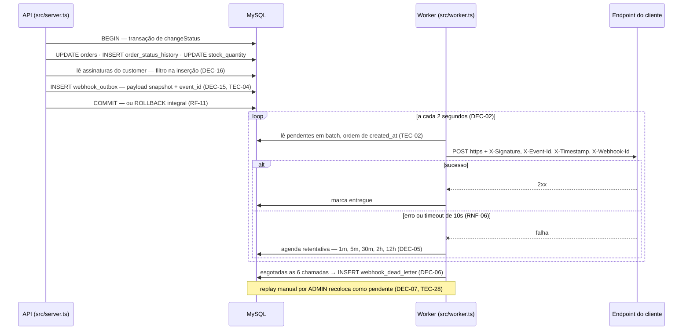

# RFC — Sistema de Webhooks de Notificação de Pedidos

## Metadados

| Campo | Valor |
|---|---|
| **Autor** | Larissa — Tech Lead (`[09:50]`: "Eu vou abrir o doc de design da feature") |
| **Status** | **Em revisão** |
| **Data** | 2026-08-16 (data de produção do documento; a reunião de origem é registrada apenas por `[hh:mm]`) |
| **Revisores** | Larissa (Tech Lead) · Marcos (Product Manager) · Bruno (Engenheiro Pleno, time de Pedidos) · Diego (Engenheiro Sênior, time de Plataforma) · Sofia (Engenheira de Segurança) |

> **Duas revisões estão pendentes e nenhuma tem data.**
> 1. **Sessão de revisão de design** com Bruno e Diego, prometida por Larissa antes do início da codificação (`[09:50]`).
> 2. **Revisão de segurança, bloqueante para deploy** — mínimo de dois dias úteis de Sofia, com foco em HMAC e geração de secret (`RNF-10` / `RES-06`).
>
> O status `Accepted` dos ADRs referenciados significa que as decisões foram fechadas na reunião, não que estas revisões ocorreram.

---

## Resumo executivo (TL;DR)

Propomos entregar notificação de mudança de status de pedido a clientes B2B por **outbox transacional no MySQL já existente**, consumida por um **worker em processo Node separado** que faz polling a cada 2 segundos e entrega por **HTTPS com assinatura HMAC-SHA256 e secret única por endpoint**. Falhas são retentadas com backoff exponencial até cobrir ~15 horas de indisponibilidade do cliente; o que não entregar cai numa **dead letter queue** com replay manual por administrador. A entrega é **at-least-once**, com `X-Event-Id` estável para o cliente deduplicar. **Nenhuma infraestrutura nova** é introduzida: nem broker, nem cache, nem dependência no `package.json` (`RES-01`, `RES-03`).

A proposta resolve o requisito de integridade (`RNF-04`) de forma absoluta e entrega dentro da stack que o time já opera. Ela **não** resolve duas coisas, e isso está explícito na seção de questões em aberto: o alvo de latência de 10 segundos não fecha no pior caso, e a ordem de eventos por pedido se quebra quando há retry.

---

## Contexto e problema

Três clientes B2B — Atlas Comercial, MaxDistribuição e Nova Cargo — fizeram pedido formal de notificação de mudanças de status de pedido (`TEC-29`). A Atlas sinalizou possibilidade de migrar para um concorrente caso a entrega não saia no prazo (`RES-04`).

O sistema **não possui hoje nenhum mecanismo de notificação externa**. A varredura registrada em `CONTEXT.md` §16 buscou em `src/`, `prisma/` e `package.json` os termos `webhook`, `event`, `queue`, `outbox`, `worker`, `retry`, `hmac`, `redis`, `kafka` e correlatos: zero ocorrências. O `docker-compose.yml` sobe apenas o MySQL.

O ponto de acoplamento é uma transação já carregada. Hoje `OrderService.changeStatus` atualiza `orders`, insere em `order_status_history` e decrementa `stock_quantity` dos produtos do pedido, tudo dentro de uma única `prisma.$transaction()` (`COD-01`/`COD-02`/`COD-03`, `src/modules/orders/order.service.ts`).

O requisito de integridade é inegociável: se a transação commitou, o evento foi registrado; se deu rollback, o evento some junto (`RNF-04`). Bruno fechou a formulação: "Não pode ter caso de status mudar e evento não sair" (`RF-11`). Isso, somado à restrição de time pequeno e stack fechada no MySQL existente (`RES-01`), delimita todo o espaço de solução.

---

## Proposta técnica

### Fluxo ponta a ponta

As sete decisões se compõem num único caminho: a **transação** registra a promessa de notificação (`ADR-001`), o **worker** a cumpre (`ADR-002`), o **retry e a DLQ** tratam o que falha (`ADR-003`), a **assinatura** prova a origem (`ADR-004`), o **`event_id`** torna o reenvio reconhecível (`ADR-005`), o **molde de módulo existente** hospeda tudo (`ADR-006`) e a **ordem por `order_id`** emerge do worker único, como limitação declarada (`ADR-007`).



A propriedade central do desenho é a **fronteira de processos**: a promessa de entrega nasce dentro da transação da API e é cumprida por um processo que não compartilha ciclo de vida com ela (`DEC-03` / `RES-05`).

```
     processo da API — src/server.ts          │      processo do worker — src/worker.ts
                                              │           npm run worker (TEC-20)
  OrderService.changeStatus                   │
  ┌─ prisma.$transaction ──────────────────┐  │   webhook.worker.ts
  │  orders                                │  │   ┌─ loop de polling, 2s ───────────┐
  │  order_status_history                  │  │   │  lê pendentes por created_at    │
  │  products.stock_quantity               │  │   │  POST https + HMAC-SHA256       │
  │  publishWebhookEvent(tx, …)   (COD-14) │  │   │  marca entregue | agenda retry  │
  └────────────────────────────────────────┘  │   └─────────────────────────────────┘
        tudo ou nada (RF-11 / RNF-04)         │      PrismaClient próprio (DEC-14)
                                              │
  ══════════ MySQL — webhook_outbox · webhook_dead_letter · configuração ═══════════
```

O módulo vive em `src/modules/webhooks/`, com os mesmos cinco arquivos dos demais módulos, mais `webhook.worker.ts` como sexto (`DEC-17`, `COD-11`). Reusa `AppError`, `errorMiddleware`, `authenticate`, `requireRole`, `validate`, o logger Pino e o padrão de schemas Zod, sem nenhuma dependência nova (`DEC-11` / `RES-03`) — o mapa completo de reuso está em [ADR-006](adrs/ADR-006-reuso-dos-padroes-existentes-do-projeto.md).

### Artefatos persistentes

Os ADRs deliberadamente não projetaram schema. Esta RFC nomeia os artefatos e declara apenas os campos **estruturantes ausentes** — aqueles sem os quais a arquitetura não fecha. Colunas e tipos ficam para o FDD.

| Artefato | Origem | Papel |
|---|---|---|
| Configuração de webhook | `TEC-13`, `CONTEXT.md` §17.6 | url, secret, `customer_id`, estado ativo, e a lista de status assinados que serve de filtro (`RF-05` / `TEC-15`) |
| `webhook_outbox` | `TEC-01`, `DEC-19` | id UUID, status indexado (pendente, processando, falhou, entregue), `created_at` indexado, payload em snapshot (`DEC-15`) e `event_id` (`TEC-04`) |
| `webhook_dead_letter` | `TEC-12`, `DEC-06` | payload, motivo da falha e timestamp — tabela separada, não marcação na outbox |
| Histórico de entregas | `ABE-04`, `RF-06` | **não projetado em lugar nenhum** — ver questões em aberto |

**Dois campos estruturantes não têm origem em nenhuma fonte e a arquitetura os exige:** uma *contagem de tentativas* e um *instante da próxima tentativa* na outbox. `TEC-01` só prevê índice em status e `created_at`, e `TEC-02` descreve o worker lendo "os pendentes mais antigos" — com isso o worker sabe *o que* está pendente, mas não tem como saber que uma linha está aguardando o intervalo de 12 horas de `DEC-05` e não deve ser tentada agora. Sem esses campos, a política de [ADR-003](adrs/ADR-003-retry-com-backoff-exponencial-e-dead-letter-queue.md) não é executável.

### Superfície de API

Contrato detalhado — payloads, status codes, semântica — é matéria do FDD. Aqui está a superfície pública, para revisão da forma. Prefixo `/api/v1` conforme `src/app.ts` e `src/routes/index.ts`.

| RF | Endpoint | Autorização | Proveniência do caminho |
|---|---|---|---|
| RF-01 | `POST /api/v1/webhooks` | autenticado (`DEC-20`) | derivado da convenção de `order.routes.ts` |
| RF-02 | `PATCH /api/v1/webhooks/:id` | autenticado | derivado |
| RF-03 | `DELETE /api/v1/webhooks/:id` | autenticado | derivado |
| RF-04 / RF-05 | `GET /api/v1/webhooks?customerId=` | autenticado | derivado |
| RF-06 | `GET /api/v1/webhooks/:id/deliveries` | autenticado | **literal** (`TEC-21`) |
| RF-07 | `POST /api/v1/webhooks/:id/rotate-secret` | autenticado | **proposto — sem origem na transcrição** |
| RF-08 | `POST /api/v1/admin/webhooks/dead-letter/:id/replay` | `requireRole('ADMIN')` (`DEC-12`) | **literal** (`TEC-22`) |

Duas ressalvas de honestidade sobre esta tabela. **RF-07 não tem caminho de origem**: Sofia especificou apenas "endpoint pro cliente conseguir pedir nova secret pela API" (`RF-07`), e o caminho acima é proposta desta RFC, não decisão. E **`customerId` vai no body do `POST` e na query do `GET`**, com o path reservado ao `:id` do próprio recurso — resolução de `ABE-03` pela convenção real de `src/modules/orders/order.schemas.ts` (`createOrderSchema` declara `customerId` no body; `listOrdersQuerySchema`, na query). A reunião fechou apenas que o `customer_id` **não vem do JWT** (`RES-07`); a forma exata segue carecendo de aval.

### Fora de escopo desta fase

Itens que a reunião **decidiu adiar** — não são questões em aberto, são fronteira de escopo:

- **`ADI-01`** — notificação por email ao cliente em falha repetida (Larissa, `[09:37]`).
- **`ADI-03`** — dashboard visual para clientes; projeto do time de frontend (Larissa, `[09:40]`).
- **`ADI-04`** — arquivamento das linhas entregues após ~30 dias (Diego, `[09:08]`). Sem ele, `webhook_outbox` e `webhook_dead_letter` crescem indefinidamente.
- **`ADI-05`** — múltiplos workers com particionamento por `order_id` ou lock pessimista (Diego, `[09:13]`).
- **`ADI-06`** — endurecimento das regras de autorização do CRUD (Sofia, `[09:37]`).

---

## Alternativas consideradas

**Despacho síncrono dentro da transação de mudança de status** (`ALT-01`). Descartada por Bruno na abertura: a transação de `changeStatus` já é pesada, e acrescentar uma chamada HTTP no meio faria qualquer cliente lento travar a mudança de status de outros pedidos. Há um segundo efeito, pior: a indisponibilidade de um cliente causaria rollback de uma mudança de status legítima. **Trade-off:** trocamos entrega imediata por desacoplamento de latência e de disponibilidade.

**Redis Streams ou fila equivalente** (`ALT-02`). Descartada por Diego como overengineering para um time pequeno: "Outbox no MySQL existente resolve." Virou a restrição `RES-01`, que governa todas as demais decisões. **Trade-off:** abrimos mão de push em milissegundos e de vazão elástica para não operar mais um serviço.

**Trigger no banco notificando o worker** (`ALT-03`). Descartada por limitação de plataforma: o MySQL não tem `NOTIFY`/`LISTEN` como o Postgres, e uma trigger só executa SQL, não avisa processo externo. Os workarounds cogitados — escrever em arquivo, bater num endpoint — foram rejeitados na própria fala que os levantou ("fica esquisito"). **Trade-off:** sem mecanismo de push disponível, polling deixou de ser escolha e virou a única opção.

**Três retentativas em vez de cinco** (`ALT-04`). Proposta por Bruno como opção mais agressiva. Descartada por Diego com um caso concreto: três tentativas em 30 minutos não sobrevivem a uma janela de manutenção planejada de duas horas, que a base de clientes já teve. Larissa fechou em cinco. **Trade-off:** cobertura de indisponibilidade acima de prontidão de entrega — o evento fica em trânsito por até ~15 horas em vez de morrer em 30 minutos.

**Retry indefinido com backoff** (`ALT-05`). Descartada por Diego pelo extremo oposto: evento fica pendurado para sempre se o cliente desaparecer. **Trade-off:** aceitamos perder entrega para cliente que sumiu, em troca de um sistema com estado terminal definido.

**Marcar eventos falhos na própria `webhook_outbox`** (`ALT-06`). Descartada em favor da tabela `webhook_dead_letter` separada: mantém limpa a leitura da outbox principal e serve de evidência para debug e reprocessamento. **Trade-off:** payload duplicado entre as duas tabelas, em troca de uma query de polling que opera só sobre linhas vivas.

**Garantia exactly-once** (`ALT-07`). Descartada por Diego por custo de coordenação bilateral: exigiria protocolo de confirmação dos dois lados, enquanto at-least-once com `event_id` "resolve 99% dos casos" e é o padrão de Stripe e GitHub. **Trade-off:** complexidade nossa transferida para o cliente. Registre-se que **Sofia levantou exatamente essa objeção — "Isso joga responsabilidade pro cliente" — e não a retirou**; Larissa fechou como decisão sem concordância explícita dela (nota de leitura (c)-4). É a única alternativa desta lista cujo descarte ainda tem discordância viva, e a revisão desta RFC é o lugar de reabri-la.

**Enviar os itens do pedido no payload** (`ALT-08`). Descartada por Diego para não inflar o evento: o cliente que quiser detalhes bate em `GET /orders/:id` depois. **Trade-off:** payload enxuto ao custo de uma chamada extra para quem precisa da composição do pedido.

---

## Questões em aberto

### Bloqueiam o início da implementação

1. **`ABE-04` — schema do histórico de entregas.** Marcos especificou o comportamento de `RF-06` (últimos 100 envios com sucesso/falha, payload, response e tempo de resposta), mas nenhuma estrutura foi projetada. O que alimenta esses registros são as até seis chamadas HTTP por evento de [ADR-003](adrs/ADR-003-retry-com-backoff-exponencial-e-dead-letter-queue.md). **Sem essa tabela, `RF-06` não é implementável.**
2. **Agendamento do retry.** Nenhuma fonte define como o worker sabe que chegou a hora da próxima tentativa. Ver os dois campos estruturantes na seção de artefatos persistentes.
3. **Armazenamento da secret em repouso.** `TEC-13` lista "url + secret + customer_id + estado ativo" sem qualificar o formato de armazenamento. Item natural para a revisão de segurança de `RNF-10`, em que Sofia declarou querer olhar "HMAC e geração de secret" com calma. Relacionado: o `redact` de `src/shared/logger/index.ts` cobre `*.password`, `*.token` e `*.accessToken`, mas **nenhum padrão que cubra `secret`**.

### Exigem decisão, mas não travam o início

4. **O alvo de latência não fecha com o desenho.** `RNF-01` pede menos de 10 segundos end-to-end; o desenho soma até 2s de espera no polling (`DEC-02`) mais até 10s de timeout na chamada ao cliente (`RNF-06`) — excede o alvo já no caminho sem retry. O conflito não foi levantado na reunião. **Saídas:** relaxar o alvo de `RNF-01`, reduzir o intervalo de polling, ou reduzir o timeout de entrega. *Recomendação desta RFC, não decidida:* relaxar o alvo, reformulando `RNF-01` como meta de caminho feliz — foi o que Marcos descreveu materialmente ("que não fique pendurado"), e é a única saída que não piora nem a carga no banco nem a tolerância a clientes lentos.
5. **O retry quebra a ordem por `order_id`.** Combinando `DEC-04` com `DEC-05`: se o evento `PAID` de um pedido falha e é reagendado para daqui a 1 minuto, e o `SHIPPED` do mesmo pedido é criado e entregue nesse intervalo, o cliente recebe `SHIPPED` antes de `PAID`. A garantia de [ADR-007](adrs/ADR-007-ordering-por-order-id-sob-single-worker.md) vale só para o caminho feliz. **Saídas:** aceitar como limitação adicional e documentá-la ao cliente junto com `DEC-04`, ou bloquear a entrega de eventos subsequentes de um `order_id` enquanto houver evento anterior em retry. *Recomendação desta RFC, não decidida:* aceitar e documentar — bloquear introduz uma fila por pedido que o desenho de polling simples não comporta, e `DEC-04` já assumiu a postura de declarar limitação em vez de construir mecanismo.
6. **`errorMiddleware` não alcança o worker.** `COD-08` afirma que o middleware de erro pega os erros do módulo sem precisar mudar nada — verdade no caminho HTTP, falso no worker, que roda fora do Express e onde um `ErrorRequestHandler` simplesmente não é invocado (`DEC-03`). Não é trade-off entre alternativas, é lacuna de cobertura: **o worker precisa do próprio limite de erro**, com o mesmo logger Pino e a mesma hierarquia `AppError`.
7. **Segundo ponto de disparo.** A reunião tratou apenas de `changeStatus` (`COD-13`). `CONTEXT.md` §17.2 identifica `OrderService.create` como um segundo lugar onde o pedido nasce em `PENDING` e grava o primeiro registro de histórico, com o mesmo padrão de acoplamento. **Nunca foi decidido se a criação do pedido gera evento** — o que determina se um cliente que assinou `PENDING` recebe algo quando o pedido nasce.
8. **Supervisão do processo do worker.** Nenhum item da transcrição trata de como o worker é mantido vivo, reiniciado ou monitorado, e `docker-compose.yml` não provisiona nenhum serviço de aplicação onde declará-lo.

### Confirmações pendentes

9. **`ABE-03`** — a convenção de `customerId` (body no `POST`, query no `GET`) é consistente com o código, mas não tem endosso de Larissa, Bruno ou Marcos. Precisa de aval na sessão de revisão de design.
10. **Concordância de Sofia com `DEC-10`** (at-least-once) — ver `ALT-07` acima. Vale confirmar antes da revisão de segurança.
11. **`ABE-01` / `ADI-02` — rate limiting de envios.** Item com classificação divergente: Diego pediu para registrar como ponto em aberto (`[09:39]`), Larissa reclassificou como "observar e decidir depois". Não há decisão de implementar nem de descartar. Relevante porque um cliente com endpoint instável gera até 6× o volume normal de requisições saindo da plataforma.
12. **Modelo de ameaça não explorado.** Assinatura assimétrica e mTLS não foram levantados por ninguém na reunião, e a assinatura de `DEC-08` cobre apenas o corpo — `X-Timestamp` e `X-Webhook-Id` trafegam fora da proteção. Material para a revisão de `RNF-10`.

---

## Impacto e riscos

| Risco | Prob. | Impacto | Mitigação | Detalhe |
|---|---|---|---|---|
| Worker cai e ninguém percebe: a API segue aceitando pedidos, a outbox acumula e os clientes só param de receber | Média | Alto | Definir supervisão, restart e alarme antes do deploy — hoje não há onde declarar o processo | [ADR-002](adrs/ADR-002-worker-em-processo-separado-com-polling.md) |
| Duplicata como consequência **garantida**, não excepcional: cliente que processa em mais de 10s recebe o evento de novo sem ter havido falha real | Alta | Médio | Documentar a garantia no portal antes do go-live e destacar `X-Event-Id` na integração | [ADR-005](adrs/ADR-005-entrega-at-least-once-com-event-id.md) |
| Cronograma: três sprints (`DEC-13`) com revisão de segurança bloqueante de ≥2 dias úteis no fim (`RNF-10`/`RES-06`), prazo externo com risco de churn da Atlas (`RES-04`) e prazo nunca confirmado com os clientes (`ABE-05`) | Alta | Alto | Agendar a revisão de Sofia **agora**, não na sprint 3 — ninguém assumiu o agendamento na reunião | [ADR-004](adrs/ADR-004-assinatura-hmac-sha256-com-secret-por-endpoint.md) |
| Autorização frouxa: qualquer usuário autenticado pode cadastrar, editar e remover webhooks de **qualquer** customer, já que o `customerId` vem do body ou da query | Alta | Alto | Estado aceito como temporário por Sofia (`DEC-20`); `ADI-06` é a saída, sem gatilho definido | [ADR-006](adrs/ADR-006-reuso-dos-padroes-existentes-do-projeto.md) |
| Falha ao registrar a promessa de notificação derruba a operação de negócio: `RF-11` faz a mudança de status depender da escrita na outbox, e o limite de 64KB (`DEC-18`) falha em vez de truncar | Baixa | Alto | Trade-off deliberado da reunião (consistência acima de disponibilidade da escrita); monitorar tamanho de payload | [ADR-001](adrs/ADR-001-outbox-transacional-no-mysql.md) |
| Replay manual não escala: cliente fora por mais de 15h gera uma linha de DLQ por evento, cada uma exigindo uma chamada separada | Média | Médio | Nenhuma operação em lote foi decidida; avaliar antes do primeiro incidente real | [ADR-003](adrs/ADR-003-retry-com-backoff-exponencial-e-dead-letter-queue.md) |

**Impacto sobre o código existente.** O acoplamento é concentrado e conhecido: uma chamada a `publishWebhookEvent(tx, order, fromStatus, toStatus)` dentro da transação de `OrderService.changeStatus` (`COD-13`/`COD-14`), o registro de um router em `src/routes/index.ts`, a instanciação do módulo em `src/app.ts`, novos modelos em `prisma/schema.prisma`, novas variáveis em `src/config/env.ts` e novas tabelas na lista de truncamento de `tests/setup.ts`. Nenhum arquivo existente muda de comportamento para quem não usa webhooks — exceto `changeStatus`, que passa a ter uma dependência de escrita a mais no caminho crítico.

---

## Decisões relacionadas

| ADR | Papel |
|---|---|
| [ADR-001 — Outbox transacional no MySQL](adrs/ADR-001-outbox-transacional-no-mysql.md) | onde a promessa de entrega nasce, e por que dentro da transação |
| [ADR-002 — Worker em processo separado com polling](adrs/ADR-002-worker-em-processo-separado-com-polling.md) | quem consome a outbox, e por que por polling |
| [ADR-003 — Retry com backoff exponencial e dead letter queue](adrs/ADR-003-retry-com-backoff-exponencial-e-dead-letter-queue.md) | o que acontece quando a entrega falha |
| [ADR-004 — Assinatura HMAC-SHA256 com secret por endpoint](adrs/ADR-004-assinatura-hmac-sha256-com-secret-por-endpoint.md) | como o cliente prova que o evento veio de nós |
| [ADR-005 — Entrega at-least-once com event id](adrs/ADR-005-entrega-at-least-once-com-event-id.md) | o que prometemos sobre duplicatas, e o contrato de headers |
| [ADR-006 — Reuso dos padrões existentes do projeto](adrs/ADR-006-reuso-dos-padroes-existentes-do-projeto.md) | onde o módulo mora e o que ele reaproveita |
| [ADR-007 — Ordering por order id sob single worker](adrs/ADR-007-ordering-por-order-id-sob-single-worker.md) | que garantia de ordem é oferecida, e sob que condição |

---

## Fontes

**Índice da transcrição** (`.scratch/fontes/transcricao-index.md`): DEC-01 a DEC-20 · RF-01 a RF-11 · RNF-01 a RNF-10 · RES-01 a RES-07 · ALT-01 a ALT-08 · ADI-01 a ADI-06 · ABE-01, ABE-03, ABE-04, ABE-05 · COD-01, COD-02, COD-03, COD-08, COD-11, COD-13, COD-14 · TEC-01, TEC-02, TEC-04, TEC-12, TEC-13, TEC-15, TEC-20, TEC-21, TEC-22, TEC-28, TEC-29 · notas de leitura (a), (b) e (c)-4.

**Arquivos reais:** `src/modules/orders/order.service.ts` (`changeStatus`, `create`), `src/modules/orders/order.schemas.ts` (`createOrderSchema`, `listOrdersQuerySchema`), `src/modules/orders/order.routes.ts`, `src/routes/index.ts` (`buildApiRouter`), `src/app.ts` (`buildApp`, `buildControllers`), `src/server.ts`, `src/middlewares/auth.middleware.ts` (`authenticate`, `requireRole`), `src/middlewares/error.middleware.ts` (`errorMiddleware`), `src/middlewares/validate.middleware.ts` (`validate`), `src/shared/errors/app-error.ts` (`AppError`), `src/shared/logger/index.ts` (`logger`, lista de `redact`), `src/config/env.ts` (`envSchema`), `prisma/schema.prisma`, `tests/setup.ts`, `docker-compose.yml`, `CONTEXT.md` §16, §17.2, §17.4, §17.6.
